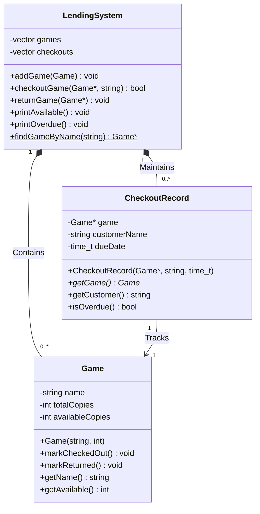

#include <iostream>
#include <string>
#include <vector>
#include <ctime>
#include <iomanip>

class Game {
private:
    std::string name;
    int totalCopies;
    int availableCopies;

public:
    Game(std::string name, int copies) 
        : name(name), totalCopies(copies), availableCopies(copies) {}

    void markCheckedOut() {
        if (availableCopies > 0) availableCopies--;
    }

    void markReturned() {
        if (availableCopies < totalCopies) availableCopies++;
    }

    std::string getName() const { return name; }
    int getAvailable() const { return availableCopies; }
};

class CheckoutRecord {
private:
    Game* game;
    std::string customerName;
    std::time_t dueDate;

public:
    CheckoutRecord(Game* game, std::string customer, std::time_t due)
        : game(game), customerName(customer), dueDate(due) {}

    Game* getGame() const { return game; }
    std::string getCustomer() const { return customerName; }
    
    bool isOverdue() const {
        return std::time(nullptr) > dueDate;
    }
};

class LendingSystem {
private:
    std::vector<Game> games;
    std::vector<CheckoutRecord> checkouts;

public:
    void addGame(const Game& newGame) {
        games.push_back(newGame);
    }

    bool checkoutGame(Game* game, std::string customer) {
        if (game->getAvailable() > 0) {
            std::time_t now = std::time(nullptr);
            checkouts.emplace_back(game, customer, now + 604800); // 1 week
            game->markCheckedOut();
            return true;
        }
        return false;
    }

    void returnGame(Game* game) {
        for (auto it = checkouts.begin(); it != checkouts.end(); ++it) {
            if (it->getGame() == game) {
                game->markReturned();
                checkouts.erase(it);
                break;
            }
        }
    }

    void printAvailable() const {
        std::cout << "\nAvailable Games:\n";
        for (const auto& game : games) {
            std::cout << "- " << game.getName() 
                      << " (" << game.getAvailable() << "/" 
                      << game.getAvailable() + (game.getAvailable() - game.getAvailable()) << ")\n";
        }
    }

    void printOverdue() const {
        std::cout << "\nOverdue Checkouts:\n";
        for (const auto& record : checkouts) {
            if (record.isOverdue()) {
                std::cout << "- " << record.getGame()->getName()
                          << " borrowed by " << record.getCustomer() << "\n";
            }
        }
    }

    // New access methods
    Game* findGameByName(const std::string& name) {
        for (auto& game : games) {
            if (game.getName() == name) {
                return &game;
            }
        }
        return nullptr;
    }

    const std::vector<Game>& getAllGames() const {
        return games;
    }
};

// Helper function to display menu
void displayMenu() {
    std::cout << "\nBoard Game Lending System\n"
              << "1. List available games\n"
              << "2. Checkout a game\n"
              << "3. Return a game\n"
              << "4. List overdue games\n"
              << "5. Exit\n"
              << "Choice: ";
}

int main() {
    LendingSystem system;
    
    // Add some sample games
    system.addGame(Game("Catan", 3));
    system.addGame(Game("Ticket to Ride", 2));
    system.addGame(Game("Pandemic", 1));

    while (true) {
        displayMenu();
        int choice;
        std::cin >> choice;
        std::cin.ignore();

        switch (choice) {
            case 1: {
                system.printAvailable();
                break;
            }
            case 2: {
                std::cout << "Enter game name: ";
                std::string gameName;
                std::getline(std::cin, gameName);
                
                Game* target = system.findGameByName(gameName);
                
                if (target) {
                    std::cout << "Enter customer name: ";
                    std::string customer;
                    std::getline(std::cin, customer);
                    
                    if (system.checkoutGame(target, customer)) {
                        std::cout << "Checked out successfully!\n";
                    } else {
                        std::cout << "No copies available!\n";
                    }
                } else {
                    std::cout << "Game not found!\n";
                }
                break;
            }
            case 3: {
                std::cout << "Enter game name to return: ";
                std::string gameName;
                std::getline(std::cin, gameName);
                
                Game* target = system.findGameByName(gameName);
                
                if (target) {
                    system.returnGame(target);
                    std::cout << "Game returned!\n";
                } else {
                    std::cout << "Game not found!\n";
                }
                break;
            }
            case 4: {
                system.printOverdue();
                break;
            }
            case 5:
                return 0;
            default:
                std::cout << "Invalid choice!\n";
        }
    }

    return 0;
}
## Class Diagram

Board Game Lending System Specification
A console program that:

    Manages board game inventory and tracks customer borrow/return activity

    Core Entities: Games (with availability counts), Checkout Records (game + customer + due date)

    Key Functionality:

        View real-time game availability

        Check out games to customers (blocks if unavailable)

        Process returns to update inventory

        Identify overdue checkouts

    Safety Guarantees: Prevents double-checkouts and invalid returns through encapsulated data access